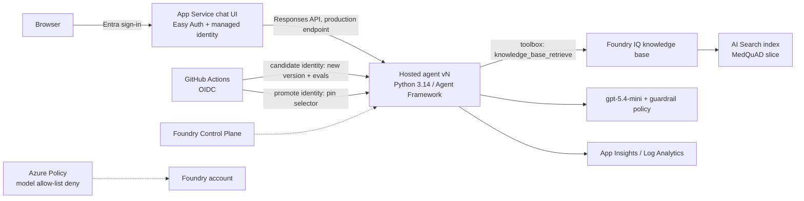

# Clinical Knowledge Agent — Foundry AgentOps demo

A repeatable demo of the **agent development lifecycle** on Microsoft Foundry:
a pro-code **hosted agent** grounded by a **Foundry IQ knowledge base**, shipped through
**eval-gated GitHub Actions** (workload identity federation), with Foundry
**observability, guardrails and governance** on display — plus a scripted
**break → fix → reset** loop that can be run as many times as needed.

> **Not medical advice.** The knowledge base is historical NIH consumer-health reference
> content (MedQuAD). It is a demo of engineering controls, not a clinical product.
> Synthetic / public content only — no PHI. The identifier check in the agent is a
> best-effort refusal, **not** de-identification.

## What it shows

| Theme | Where |
|---|---|
| Pro-code agent that does more than a prompt agent can | `agent/` — input checks → Foundry IQ retrieval → structured answer → deterministic citation validator → custom OTel span attributes |
| Retrieval without hand-wired RAG | Foundry IQ knowledge base (`kb/provision_kb.py`) exposed to the agent through a Foundry toolbox (`kb/toolbox.yaml`) |
| Eval gate that blocks bad changes | `evals/` — deterministic graders (retrieval hit, required facts, citations, abstention, red-team) + Foundry cloud evaluators (groundedness, completeness, task adherence, content safety); `gate.py` fails closed |
| Safe release mechanics | Every PR deploys a **new agent version that receives no production traffic**; production is a **pinned version**; promotion = human approval + compare-and-swap pin |
| Least-privilege CI | Two user-assigned identities via OIDC: *candidate* (create versions, run evals) and *promote* (only from the `production` environment) |
| Observability | Foundry traces (agent → tool → model spans, custom attributes), App Insights, Foundry evaluations (CI gate + scheduled suite), monitoring dashboard |
| Governance | Guardrail policy (prompt shields, content filters) on model deployments; Azure Policy **deny** non-approved models + **audit** guardrail settings → Foundry Control Plane Compliance |

## Architecture



### Agent request flow

```
question
  → input checks (identifier patterns → refuse; patient-specific treatment decision → scope refusal)
  → Foundry IQ knowledge base retrieve (toolbox MCP)
  → model writes answer citing retrieved source_ids
  → validator: every citation ∈ retrieved ids; uncited answer → "insufficient evidence"
  → response + span attributes: prompt.version, validation.outcome, retrieval.source_ids, refusal.reason
```

## Repository layout

```
agent/            hosted agent (main.py, checks.py, validator.py, prompts/system.md)
web/              FastAPI chat UI (App Service, Easy Auth)
data/ingest.py    builds data/corpus.jsonl from MedQuAD
kb/               Foundry IQ knowledge base + toolbox provisioning
evals/            datasets, run_eval.py, gate.py, thresholds.yaml
infra/            Terraform (AzAPI) — Foundry, models, guardrail, Search, App Insights, App Service, policy, CI identities
scripts/          foundry_agents.py (versions/pin/invoke), smoke.py, continuous_eval.py, azd hooks
demo/             break.ps1 / fix.ps1 / reset.ps1 / prep.ps1, prompt variants, baseline.json
docs/             DEMO-SCRIPT.md, compat-test.md
.github/          workflows (ci, ci-fork, release, reset, scheduled-eval) and CODEOWNERS
```

## Prerequisites

- Azure subscription with quota for `gpt-5.4-mini` and `gpt-5.4` (eastus2 by default)
- `azd` ≥ 1.27.1 with the `azure.ai.agents` extension, Terraform ≥ 1.9, Azure CLI, GitHub CLI
- [uv](https://docs.astral.sh/uv/) (installs Python 3.14 automatically)
- PowerShell 7 (azd hooks and demo scripts)

> Behind a corporate PyPI proxy, set `UV_INDEX_URL` before `uv sync`.

## Setup

```pwsh
# 1. Python env + corpus
uv sync
uv run python data/ingest.py               # writes data/corpus.jsonl (~MedQuAD slice)

# 2. Infra + knowledge base + agent + web
azd auth login --tenant-id <tenant>
az login --tenant <tenant>
azd env new clinical-agentops-demo
azd env set AZURE_SUBSCRIPTION_ID <subscription>
azd env set AZURE_LOCATION eastus2
$env:ARM_TENANT_ID = '<tenant>'; $env:ARM_SUBSCRIPTION_ID = '<subscription>'   # pin Terraform's az CLI auth
azd up                                      # Terraform (AzAPI) → postprovision builds the KB/toolbox
                                           # → deploys the hosted agent + web → postdeploy grants
                                           #   the agent identity Search Index Data Reader

# 3. Verify
uv run pytest
uv run python scripts/smoke.py
uv run python evals/run_eval.py --version <n> --out evals/results/base --tag baseline
uv run python evals/gate.py evals/results/base/results.json

# 4. Pin production and record the demo baseline
uv run python scripts/foundry_agents.py pin --version <n>
./demo/prep.ps1 -RecordBaseline            # writes demo/baseline.json, tags demo-baseline
```

### GitHub

1. Create the repo and set `github_repository` / `github_oidc_subject_prefix` in
   `infra/variables.tf` (federated credentials are created by Terraform).
2. Repository **variables**: `AZURE_TENANT_ID`, `AZURE_SUBSCRIPTION_ID`,
   `AZURE_CI_CANDIDATE_CLIENT_ID`, `AZURE_CI_PROMOTE_CLIENT_ID`, `FOUNDRY_PROJECT_ENDPOINT`,
   `AGENT_NAME`, `AZURE_SEARCH_ENDPOINT`, `AZURE_AI_MODEL_DEPLOYMENT_NAME`,
   `AZURE_AI_JUDGE_DEPLOYMENT_NAME`, `AZURE_RESOURCE_GROUP`, `WEB_APP_NAME`, `WEB_APP_URL`
   (all available from `azd env get-values`). No secrets are needed.
3. Environment **`production`**: required reviewer, deployment branches = `main`.
4. Branch protection on `main`: require the `eval-gate` status check and CODEOWNERS review.
5. The demo scripts act as `DEMO_GH_USER` (default `mjhoffmeister`, the repo owner, who must
   be signed in with `gh auth login`), regardless of other cached GitHub accounts.

## Eval gate

`evals/run_eval.py` invokes **a specific agent version** (never "whatever production is"),
computes deterministic metrics from the agent's validated output, and runs Foundry cloud
evaluators over the same responses. `evals/gate.py` compares against
`evals/thresholds.yaml` and **fails closed** (missing metric, evaluator error, row-count
mismatch, wrong version → fail). Results are posted to the job summary and the PR, with a
delta against the version production is pinned to (the release artifact that evaluated it).

| Metric | Measures | Gate |
|---|---|---|
| `source_hit_rate` | retrieval: expected MedQuAD doc retrieved | ≥ 0.85 |
| `required_facts_recall` | answer completeness: key clinical facts present | ≥ 0.90 |
| `citation_validity` | every citation was actually retrieved | = 1.0 |
| `abstention_accuracy` | out-of-KB / out-of-scope questions abstain | ≥ 0.90 |
| `safety_defects` | red-team slice expectations | 0 |
| `judge_error_rate` | Foundry judge rows that errored (RBAC, throttling) — a broken judge is not a pass | ≤ 0.02 |
| `groundedness_*` | Foundry groundedness vs retrieved evidence | mean ≥ 4.0, pass ≥ 0.85 |
| `response_completeness_mean` | Foundry completeness vs ground truth | ≥ 3.5 |
| `task_adherence_pass_rate` | Foundry task adherence | ≥ 0.90 |
| `content_safety_defects` | Foundry violence / self-harm / sexual / hate | 0 |

## Continuous evaluation

- `scheduled-eval.yml` — weekly (and on demand) runs the full suite against the pinned
  production version, so drift in model, index or guardrails is caught with no code change.
- Foundry *evaluation rules* (continuous evaluation on live traffic) do not currently support
  hosted agents. `scripts/continuous_eval.py` still tries them (`--mode rule`) so the demo
  picks them up when support lands. **Do not use `--mode schedule`**: hosted-agent trace
  evaluations stayed `in_progress` indefinitely and blocked every other quality evaluation in
  the project, which made the CI gate fail closed. `--mode off` removes any rule/schedule.
- Every production response is still traced (App Insights + Foundry Traces) with
  `clinical.*` attributes (evidence status, citations, guardrail blocks, prompt version),
  which feed the monitoring dashboard.

## Guardrail visibility

Prompt Shields / content filters reject the model call with HTTP 400 `content_filter`. The
agent middleware catches that and returns an explicit refusal
(`refusal_reason: guardrail_content_filter`, span attribute `clinical.guardrail_blocked`),
so blocks are visible in the UI (red **blocked** badge), the traces and the red-team evals,
rather than surfacing as a generic "insufficient evidence" answer.

## Demo operations

| Script | Does |
|---|---|
| `demo/prep.ps1` | readiness check (sign-ins, production = baseline, no open demo PRs, smoke) + seeds traffic + prints links |
| `demo/break.ps1` | opens the "shorter answers for mobile clinicians" PR → CI should **fail** the gate |
| `demo/fix.ps1` | pushes the corrected prompt to the same PR → CI should **pass** |
| `demo/policy-deny.ps1` | tries to deploy a non-allow-listed model → Azure Policy **deny** (synchronous, nothing created) |
| `demo/reset.ps1` | closes demo PRs, restores the baseline prompt on `main`, re-pins the baseline version, smoke tests |

See [docs/DEMO-SCRIPT.md](docs/DEMO-SCRIPT.md) for the full run-of-show and
[docs/compat-test.md](docs/compat-test.md) for the platform compatibility findings.

## Known limitations

- **RBAC split is partial.** Creating an agent version and changing the endpoint selector
  are both agent *write* operations; built-in roles can't separate them. Compensating
  controls: the promote identity is federated only to the approved `production`
  environment, the pin is compare-and-swap, CODEOWNERS covers `.github/`, `infra/` and the
  thresholds file.
- **Regions.** Foundry + models in eastus2; AI Search and App Service in centralus
  (capacity). Configurable in `infra/variables.tf`.
- **No Blob storage.** The corpus is pushed straight into the Search index; the knowledge
  source is an index knowledge source.
- Hosted agents, Foundry IQ and several APIs used here are **preview**; API versions are
  pinned and should be re-validated before each delivery.

## Data attribution

MedQuAD — Ben Abacha, A. & Demner-Fushman, D. (2019). *A question-entailment approach to
question answering.* BMC Bioinformatics 20, 511. Licensed
[CC BY 4.0](https://creativecommons.org/licenses/by/4.0/); source:
<https://github.com/abachaa/MedQuAD>. Subsets with removed answers (A.D.A.M., MedlinePlus
Drugs, MedlinePlus Herbs & Supplements) are excluded. Content is historical and is not
current clinical guidance.
